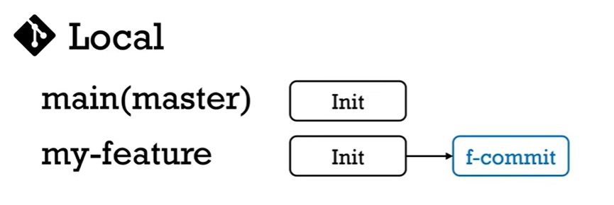
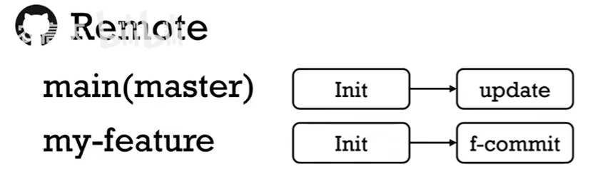
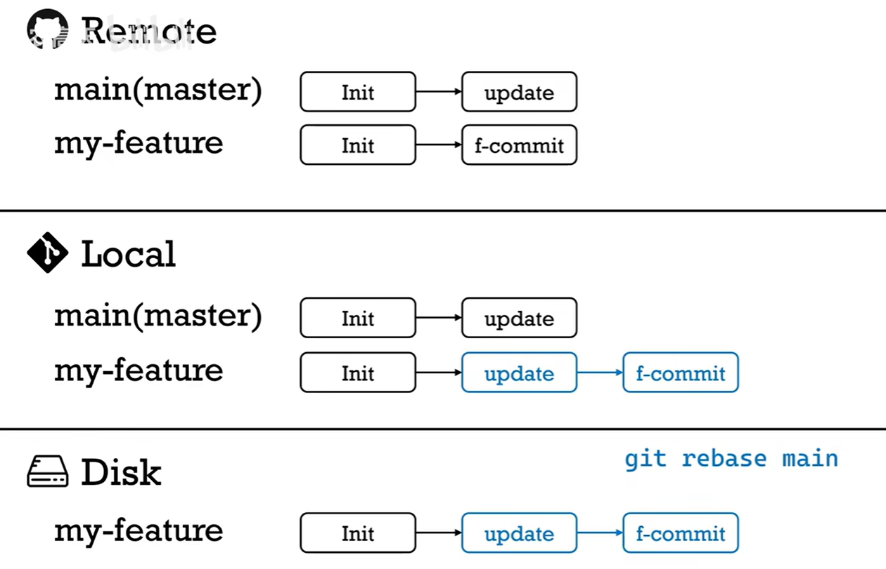

# github基础概念及工作流

## git分支，branch

当你创建一个新的git仓库时，他会自动创建一个默认分支，通常为master或者main。

同时，你也创建独立分支，每个分支都代表一个独立的工作路径，拥有各自的提交历史。你可以在不同的分支上同时进行不同的工作，而他们在合并前互不干扰。

目的： 并行开发，互不干扰。

功能隔离，独立分支充当代码的试验场。独立分支修改成功后，再合并回主分支。独立分支的修改不会影响主分支的工作。

高效的版本管理与错误修复。你可以通过分支来管理项目的不同版本，如v 1.0, v 2.0

当有紧急的bug需要修复时，你可以基于主分支快速创建一个修复分支，修复并测试无误后再合并回主分支。

常见的分支有哪些？main branch, feature branch, develop branch, release branch等

主分支 master，main，存放稳定的代码

开发分支 develop：集成日常开发成功，存放最新但可能不稳定的代码

功能分支 feature，user-login：开发某个具体的新功能，通常从develop分支创建

发布分支 release，v 1.2.0：准备新版本发布，进行最后的测试和微小修复

热修复分支 hot fix，critical-bug，紧急修复线上版本的严重bug

## 仓库，repository

**repository是一个专门为我的项目准备的数据库。**

仓库主要分为两种类型，本地仓库和远程仓库。本地仓库位于你自己的电脑上，你日常的代码修改和版本维护就在此进行。远程仓库位于github，gitee这种代码托管平台上。

本地仓库会存储你的每一次commit记录，并且存储的方式非常高效，即使你进行了成千上万次commit，其.git文件夹的大小也远远小于项目本身要占的空间。本地仓库是你的私人工作空间，你可以在没有网络的情况下自由编码和保存进度。

远程仓库主要用于团队协作，它允许多个开发者可以基于同一个代码库工作。团队成员可以将自己的更改推送到远程仓库，或是获取他人的最新工作成果。

远程仓库位于稳定的服务器上，为团队的代码提供了一个安全的异地备份。即使个人电脑故障，项目代码不会丢失。他是现代开发流程中，实现代码审查、持续集成、持续部署的基础设施。**这个远程仓库就称为remote**

## 提交，commit

如果说repository是数据库里的一条条记录，那么每次提交commit就是给当前项目的状态拍了一张快照。这次commit永久的保存了你的工作进度。

一次commit包含以下信息：

修改内容：本次commit修改了哪些文件

提交说明：在提交时你使用-m参数添加的描述信息，解释了这次修改的目的

作者和时间戳：谁在什么时候完成了这次提交

## disk，local和remote

disk/workspace：你的磁盘和工作区。这是你电脑上可以直接看到的项目文件和文件夹。你在使用编辑器（VScode）写代码，添加新文件或者删除旧文件时，所有更改最初发生于此。

local：本地仓库；它位于项目根目录下的一个隐藏文件夹.git中，这个目录保存了你的每一次提交的完整快照，所有branch的历史、标签数据。绝大多数git操作都在本地完成，无需网络连接。你可以安心尝试自己的想法，所有历史版本都安全的保存在本地，随时可以回退。

remote：远程仓库；核心目的是协作和备份。团队成员通过git push将本地提交推送到远程仓库，也通过git pull从远程仓库获取他人的最新提交，从而实现代码集成。

## 工作流

**我们介绍的是较为规范的公司工作流，尤其是对于多个程序员参与的大型项目开发，使用规范的git工作流可以有效规范开发过程。个人在开发的时候可能是去单纯的使用add git push，但养成良好的习惯总归不是坏事**

当我们想要对某个项目commit做出贡献的时候，第一步是将其clone到本地，在本地复制一个一模一样的仓库。

~~~
git clone https://github.com/example/example.git
~~~

刚clone完时，remote，local和disk上的项目代码都完全一样。我们希望修改代码，首先要在local上创建一个feature branch（用于开发特定新功能）

建立feature branch，而非直接向你的main branch commit代码有很多好处。这不仅不会破坏主分支的正常工作，也非常有利于多人合作。每个人在自己的branch上进行开发

~~~
git checkout -b my-feature
~~~

这个命令会复制一份你当前branch的内容到你的新branch上。此时，在local git中，有main branch和my-feature branch两个分支。

当你在disk、workspace上修改代码时，你的disk上的文件是会有变化的，但git对你disk上文件的变化一无所知

你可以使用如下命令，查看disk上的代码和你git上保存的分支有什么区别

~~~
git diff
~~~

当我们决定要将修改的文件提交给git的时候，可以使用

~~~
git add <changed_file>
~~~

此时git知道了你有一些文件想要修改。

在你添加完所有你想修改的文件之后，可以使用

~~~
git commit
~~~

将这些修改真正的放到git中。

此时，你的local git中就会新增一个commit。即，my-feature branch已经和main branch不一样了。同时，my-feature branch中保存了init和f-commit两份commit

如果你想要告知github，使用如下命令

~~~
git push origin my-feature
~~~

github中会多出来一个branch：my-feature。这个branch中保存着你代码的改动

加入remote中的main此时有了一个update

使用

~~~
git checkout main
~~~

将disk中当前的工作环境切换到main分支里面，然后

~~~
git pull origin master
~~~

将remote中的update同步到local和disk中

~~~
git checkout my-feature
~~~

此时切换回my-feature branch，此时disk中的代码仍旧是没有update的版本，然后

~~~
git rebase main
~~~

把我的修改都扔到一边，然后把main最新的修改update拿过来，再在此基础上，把我的f-commit 给尝试弄回去

此时可能出现 rebase conflict

需要你手动的选择保留哪段代码

随后，将我们本地的my-feature push到remote 的my-feature分支上

~~~
git push -f origin my-feature
~~~

最后，我们将my-feature与main分支合并，这个过程称为pull request。分支向主分支请求合并

主分支的主人决定是否合并，并使用squash and merge合并后commit。一般，当my-feature分支成功merge进main branch之后，我们会直接在remote上删除my-feature分支

随后，依旧先在disk上切换回main分支

~~~
git checkout main
~~~

随后使用

~~~
git branch -D my-feature
~~~

在本地将local中的my-feature分支也删掉

最后使用

~~~
git pull origin master
~~~

将remote main分支上最新的commit给拉取到local和disk上