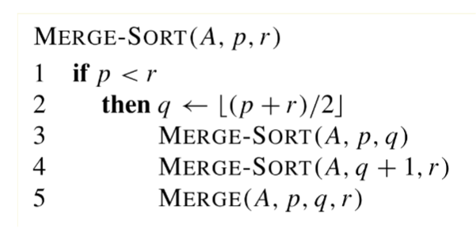

# 归并排序示例代码

~~~
#include <iostream>
#include <vector>
using namespace std;

// 合并两个有序子数组 arr[l..mid] 和 arr[mid+1..r]
void merge(vector<int>& arr, int l, int mid, int r) {
    // 创建临时数组存放合并后的结果
    vector<int> temp(r - l + 1);
    int i = l;      // 指向左子数组的起始位置
    int j = mid + 1; // 指向右子数组的起始位置
    int k = 0;      // 指向临时数组的当前索引

    // 遍历两个子数组，选择较小的元素放入临时数组
    while (i <= mid && j <= r) {
        if (arr[i] <= arr[j]) {
            temp[k++] = arr[i++];
        } else {
            temp[k++] = arr[j++];
        }
    }

    // 将左子数组剩余元素复制到临时数组
    while (i <= mid) {
        temp[k++] = arr[i++];
    }
    // 将右子数组剩余元素复制到临时数组
    while (j <= r) {
        temp[k++] = arr[j++];
    }

    // 将临时数组的内容复制回原数组
    for (k = 0, i = l; i <= r; ++i, ++k) {
        arr[i] = temp[k];
    }
}

// 归并排序主函数
void mergeSort(vector<int>& arr, int l, int r) {
    if (l < r) {
        // 找到中间点，划分数组
        int mid = l + (r - l) / 2;
        // 递归排序左半部分
        mergeSort(arr, l, mid);
        // 递归排序右半部分
        mergeSort(arr, mid + 1, r);
        // 合并两个已排序的子数组
        merge(arr, l, mid, r);
    }
}

// 主函数示例
int main() {
    vector<int> arr = {12, 11, 13, 5, 6, 7};
    cout << "排序前: ";
    for (int num : arr) {
        cout << num << " ";
    }
    cout << endl;

    mergeSort(arr, 0, arr.size() - 1);

    cout << "排序后: ";
    for (int num : arr) {
        cout << num << " ";
    }
    cout << endl;
    return 0;
}
~~~

