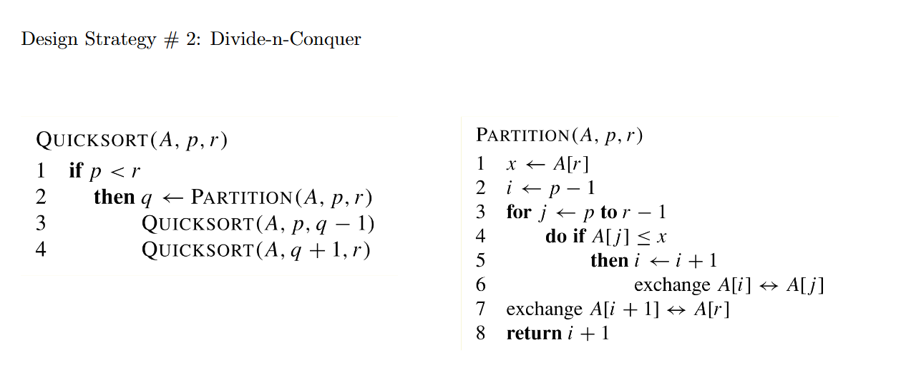
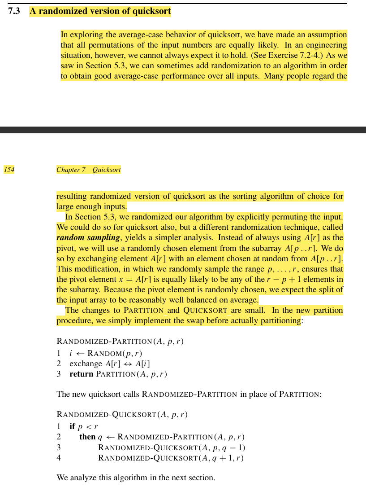

PARTITION首先取p到r的末尾元素作为pivot，比pivot小的放前面，比pivot大的放后面

最后再讲pivot从末尾移到他应该在的索引位置，并且返回对应的索引i+1。

QUICKSORT是总的快速排序函数，初始输入为0，size-1

q记录的是在一轮快速排序后，pivot所在的位置。

随后递归QUICKSORT除了pivot所在index的左序列和右序列。此时pivot所在的位置就是他应当所处的位置。

终止条件是什么？p>=r。为啥不用l？left和right不比这个p直观多了，无语

随机快排，为pivot的选取增加了一点随机性。从选择子序列末尾元素作为pivot，变成了从left到right随机选取一个元素后，与末尾元素交换，再进行partition